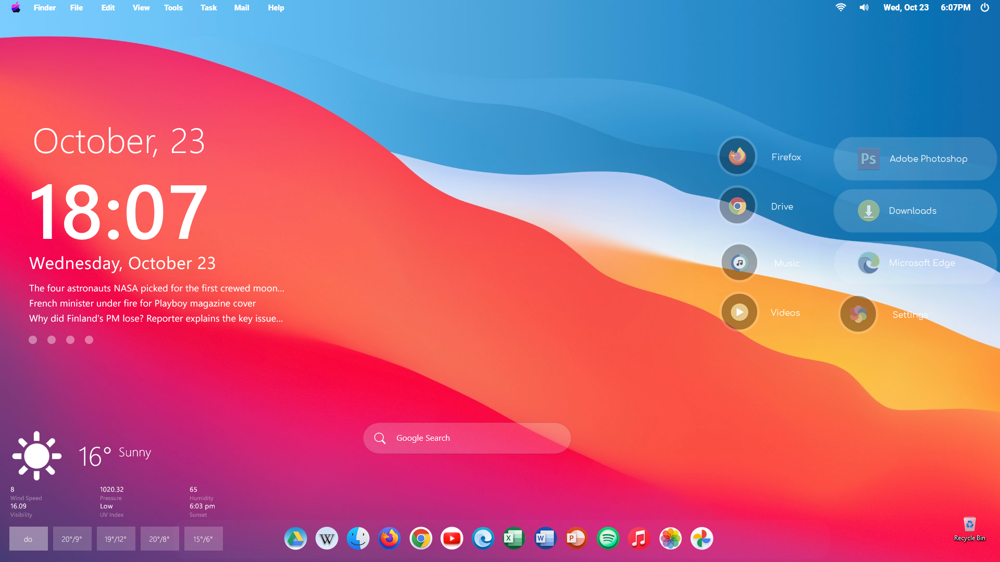

# RainMeterCustomUI_Windows11 

## Required Software (RainMeter)

### Installation
1. Download the RainMeterCustomUI_Windows11.zip file from the repository.
2. Extract the contents of the zip file to a folder on your computer.
3. Copy the Rainmeter folder to documents folder 
4. Restart  Rainmeter to apply the new skin.

